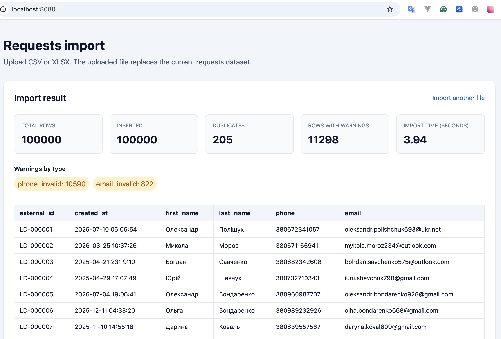
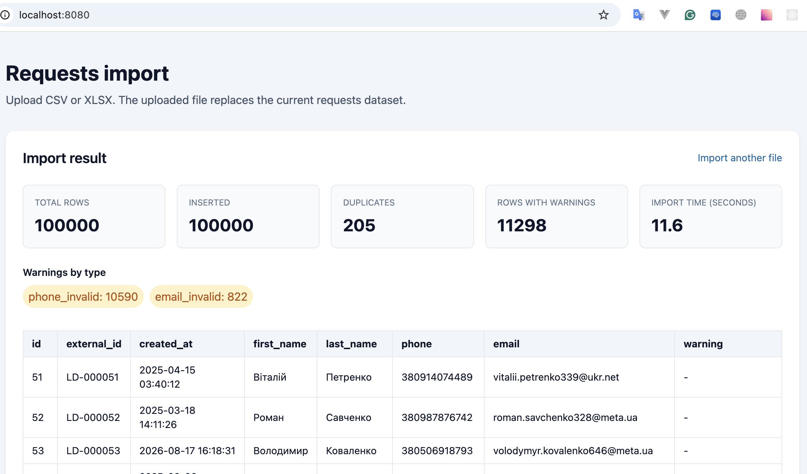

# Імпорт заявок

Вебзастосунок на Phalcon Micro для імпорту заявок із CSV та XLSX. XLSX конвертується у тимчасовий CSV через `ZipArchive` і `XMLReader`. Дані читаються потоково та записуються до MySQL-сумісної бази пакетами по 1000 рядків.

Новий імпорт **замінює весь поточний набір записів** у таблиці `requests`. Таблиця містить лише 15 колонок із файлу. Історія імпортів і службові лічильники у базі не зберігаються: статистика розраховується в пам’яті та повертається після завершення запиту.

## Виконавець

Завдання реалізував AI-асистент Copilot SDK у VS Code.

## Версії та Docker-оточення

| Компонент | Версія / образ |
|---|---|
| PHP | 7.2.34 (`php:7.2-apache-buster`) |
| Phalcon | 3.4.5, PHP C extension |
| Composer | 2.10.3 |
| База даних | MariaDB 10.11.19 (`mariadb:10.11`), сумісна з MySQL |
| Docker Compose | Compose plugin v2 |

У `docker-compose.yml` визначені сервіси:

- `web` — PHP/Apache, застосунок доступний на [http://localhost:8080/](http://localhost:8080/);
- `db` — MariaDB; порт бази на хості `3306`;
- `phpmyadmin` — вебінтерфейс бази на [http://localhost:8081/](http://localhost:8081/).

PHP налаштований приймати файли до 32 МБ, POST-запити до 40 МБ і має `max_execution_time=30`. Застосунок не змінює ліміт часу виконання програмно.
На Linux Apache запускається з GID групи хоста, якій належить bind mount `app/storage/uploads`, щоб зберігати завантаження. Значення `HOST_GID` у `.env` має збігатися з результатом `id -g`; каталог повинен мати груповий доступ на запис (`chmod g+rwx app/storage/uploads`). На macOS додаткові права зазвичай не потрібні.

## Встановлення та запуск

Потрібні Docker Engine та Docker Compose v2.

1. Клонуйте репозиторій і перейдіть у його кореневу директорію.
2. Створіть локальний файл середовища на основі прикладу:

   ```bash
   cp .env.example .env
   ```

3. За потреби змініть значення у `.env`. Приклад містить тестові облікові дані — не використовуйте їх у production. На Linux перевірте `HOST_GID` (команда `id -g`) і груповий доступ на запис до `app/storage/uploads`. `COMPOSER_ROOT_VERSION` задає версію кореневого пакета для Composer (наприклад, `dev-main` для гілки `main`); у `.env` вкажіть версію, що відповідає вашій гілці або релізу.
4. Зберіть і запустіть сервіси:

   ```bash
   docker compose up -d --build
   ```

5. Встановіть Composer-залежності:

   ```bash
   docker compose exec web composer install
   ```

6. Переконайтеся, що сервіси працюють:

   ```bash
   docker compose ps
   docker compose exec web php -v
   docker compose exec web php -r 'echo Phalcon\Version::get(), PHP_EOL;'
   docker compose exec web composer --version
   docker compose exec db mysql --version
   ```

Схема `requests` створюється застосунком із `app/migrations/001_init.sql`. Це разовий імпортний застосунок, він не має окремих сценаріїв оновлення схеми з попередніх версій.

## Імпорт через вебінтерфейс

1. Відкрийте [http://localhost:8080/](http://localhost:8080/).
2. Виберіть `.csv` або `.xlsx` файл і натисніть **Import file**.
3. Дочекайтеся завершення запиту. Сторінка покаже кількість рядків, кількість повторних `external_id`, рядки з попередженнями, їхні типи та час імпорту.
4. У таблиці результатів відображаються `external_id`, `created_at`, `first_name`, `last_name`, `phone` та `email`. Для перегляду набору використовуйте **Previous** і **Next**.

Лічильники показуються після завершення синхронного запиту; під час обробки індикатор демонструє, що запит триває. Кожен успішний імпорт очищає попередній набір і записує новий.

## Імпорт і перевірка з CLI

Надані тестові файли мають бути доступні в `docs/`:

```bash
docker compose exec web sh -lc 'cd /var/www/html && php cli/import.php /var/www/html/docs/База_даних_-_Аркуш1.csv'
docker compose exec web sh -lc 'cd /var/www/html && php cli/import.php /var/www/html/docs/База_даних.xlsx'
```

CLI-команда показує кількість прочитаних і записаних рядків, дублікати, рядки з попередженнями, тривалість та використання пам’яті. Щоб перевірити поточну таблицю через MySQL:

```bash
docker compose exec db mysql -uphalcon -psecret phalcon_app
```

```sql
SELECT COUNT(*) AS total_rows FROM requests;

SELECT external_id, created_at, first_name, last_name, phone, email
FROM requests
ORDER BY external_id
LIMIT 50;
```

Тест нормалізації можна запустити так:

```bash
docker compose exec web sh -lc 'cd /var/www/html && php tests/RowNormalizerTest.php'
```

## Правила обробки даних

- Таблиця містить лише 15 полів із вихідного файлу, без первинного ключа, додаткових колонок та індексів.
- `external_id` не є унікальним: усі рядки записуються. Кількість повторних значень рахується в пам’яті імпортера.
- Порожні та некоректні значення обробляються нормалізатором; для необов’язкових некоректних полів зберігається `NULL`, а причини враховуються у лічильниках попереджень.
- Під час обробки використовується потокове читання CSV і багаторядкові `INSERT` пакетами по 1000 рядків.
- Для XLSX зберігаються позиції порожніх клітинок, значення перетворюються відповідно до адрес клітинок, а тимчасові файли видаляються після обробки.

## Результати тестування

Перевірено на наданих файлах, кожен з яких містить 100 000 рядків даних:

| Формат | Рядків | Час імпорту |
|---|---:|---:|
| CSV | 100 000 | 3.94 с |
| XLSX | 100 000 | 11.48 с |

Час XLSX включає конвертацію у CSV та запис даних у базу.

### Результат CSV



### Результат XLSX


